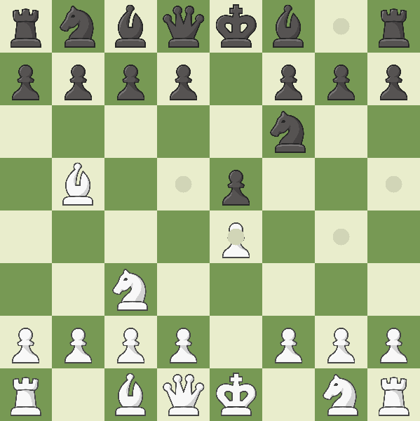
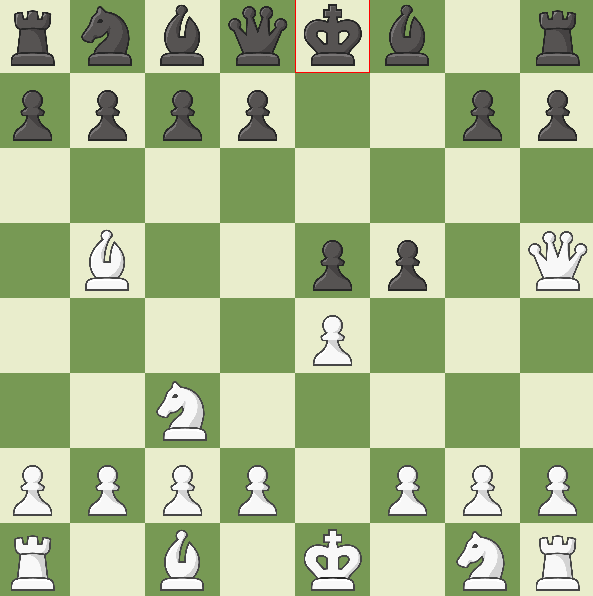

# Bitboard chess
*(This project is something I like to work on in my free time, so keep that in mind when you explore it!)*

This chess game stands out from the rest through leveraging bitboards to represent the chessboard and manage game states!   

Developed in C++, currently this application only supports player vs. player chess, however can (and hopefully will be in the future) expanded upon to incorporate a player vs. AI gamemode.   

The GUI for this application was inspired by [chess.com](https://www.chess.com/home).

</img> </img>

# Features
- Check/ Checkmate detection
- Pinned piece detection
- Interactive GUI (built using SDL2)
- Real time visual feedback for valid moves and check
- Audio feedback for game initialisation, valid moves, captures, check, and checkmates

# How to run

First begin by cloning the repository using   

```
git clone https://github.com/abda-1/bitboard-chess.git
```

## On Windows
After navigating to the `bitboard-chess` directory, run

```
make chess
./chess.exe
```

## On macOS
First, ensure you have the required SDL2 libraries installed through Homebrew:

```
brew install sdl2 sdl2_image sdl2_mixer
```

Then build and run the project:

```
make
./chess
```

# How to play ?
As per standard chess rules, white will begin the game. A user is able to click and hold onto a piece and then drag it to any of the valid positions that have been highlighted on the board.   

All moves exluding pseudo-legal moves such as castling, en-passant, and pawn promotion are currently available.


# What is a bitboard?
A rather conventient approach to representing the state of a chess board at any given moment is through the use of 64-bit unsigned integers. When a piece is located at a specific position within the board, the corresponding bit within their bitboard is set. My game leverages twelve individual bitboard (one for each piece type) to generate attacks, moves, and filter out legal moves.   

The image below displays the correlation between the bits within the bitboard, and the chess board itself.   

<p align="center">
  
</p>
