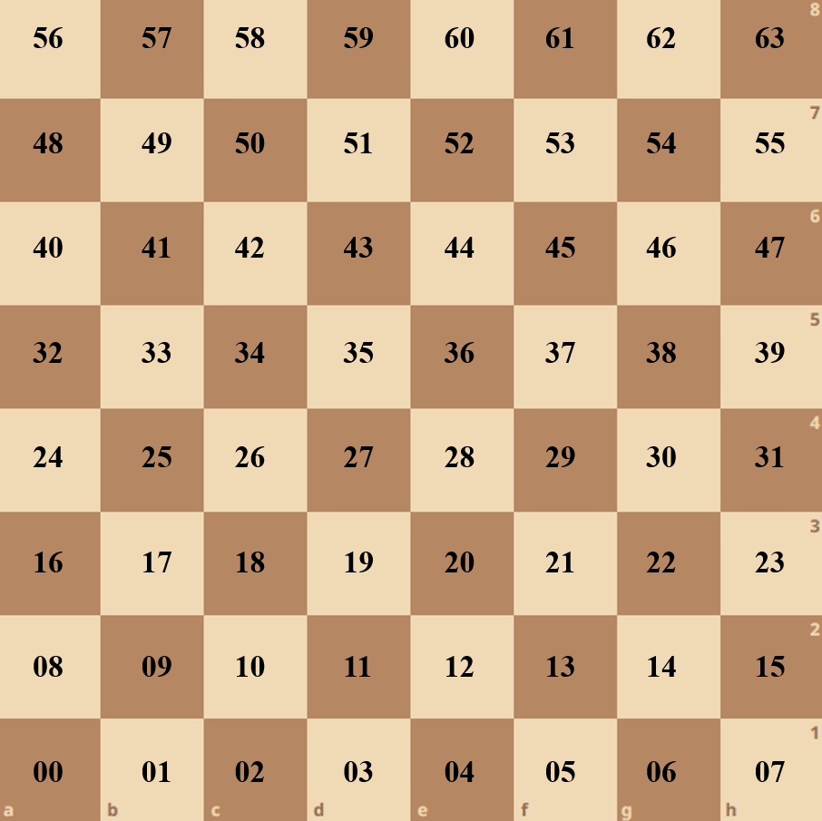

# bitboard chess
This chess game stands out from the rest through leveraging bitboards to represent the chessboard and manage game states!   

Developed in C++, currently this application only supports player vs. player chess, however can (and hopefully will be in the future) expanded upon to incorporate a player vs. AI gamemode.   

The GUI for this application was inspired by [chess.com](https://www.chess.com/home).

</img> </img>

# Features
- Check/ Checkmate detection
- Pinned piece detection
- Interactive GUI (built using SDL2)
- Real time visual feedback for valid moves and check
- Audio feedback for game initialisation, valid moves, captures, check, and checkmates

# What is a bitboard?
A rather conventient approach to representing the state of a chess board at any given moment is through the use of 64-bit unsigned integers. When a piece is located at a specific position within the board, the corresponding bit within their bitboard is set. My game leverages twelve individual bitboard (one for each piece type) to generate attacks, moves, and filter out legal moves.   

The image below displays the correlation between the bits within the bitboard, and the chess board itself.   

  

